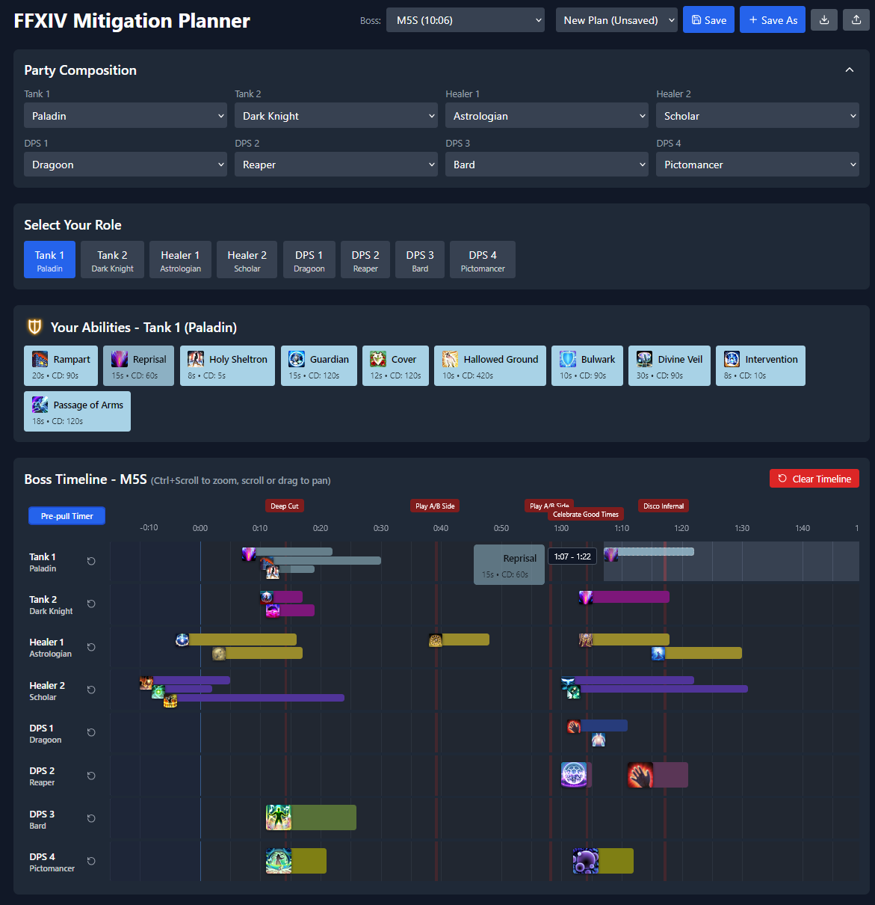

# FFXIV Mitigation Planner

**[▶ Live demo](https://emilyansell.github.io/MitigationPlanner/)** — runs in the browser, nothing to install.

A utility for planning mitigation abilities in FFXIV encounters. Drag and drop abilities
onto a boss attack timeline and get a visual representation of their durations and
cooldowns — no spreadsheets or doing timestamp math in your head. Save plans locally,
or import/export them as JSON.

## Features

- Drag-and-drop ability placement with real-time cooldown-conflict validation —
  blocked windows are computed per ability, and valid drop zones are highlighted while dragging
- Snap-to-valid-zone placement and multi-charge ability simulation
- Togglable 15-second pre-pull window for abilities that can be used before the encounter starts
- Timeline zoom and pan, scaled rendering keeps abilities readable at any zoom level
- Plans persist in localStorage, with JSON import/export

## Tech

React + Vite + Tailwind CSS. No backend — all state is managed in React.

CI/CD via GitHub Actions: releases sync to AWS S3, and the public demo deploys
to GitHub Pages on merge to `main`.

## Run locally

    npm install
    npm run dev

`npm run build` for a production build, `npm run lint` for ESLint.

## Status & roadmap

Active work in progress — current plans and known issues are tracked in this
repo's [Issues](../../issues).
Releases are grouped into milestones, tracked in [Milestones](../../milestones).

## Credits

Adopted from [ayblodgett/MitigationPlanner](https://github.com/ayblodgett/MitigationPlanner)
([original roadmap](https://github.com/ayblodgett/MitigationPlanner/issues/1)); since
extended, refactored, and re-deployed.
